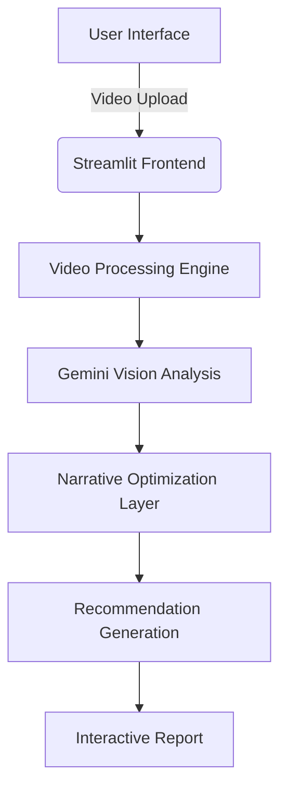

<div align="center">

# VidGenius

**GENAI-POWERED NARRATIVE OPTIMIZATION**

[](https://python.org)
[](https://streamlit.io)
[](https://ai.google.dev)

*Video Analysis Engine - Powered by Gemini 2.0*

</div>

---

## 🖥️ System Overview
VidGenius is an enterprise-grade video optimization platform leveraging Google's Gemini multimodal AI for:
- Automated content analysis
- Narrative structure optimization
- Technical editing recommendations
- Redundancy detection & timeline segmentation


---

## 🛠️ Technical Architecture

### Core Components


### ✨ Key Features
#### Multimodal Video Analysis
- 🎥 Frame-by-frame content understanding
- 🌜 Narrative structure evaluation

#### AI-Powered Optimization
- ⚙️ Technical editing recommendations
- ⏱️ Timeline segmentation

#### Enterprise-Grade Features
- 🔒 Secure file handling
- 📊 Interactive analysis reports
- ⚡ Real-time processing

---

## 🚀 Getting Started

### Prerequisites
- Python 3.10+
- Google Gemini API Key
- Phidata API Key

### Installation
```bash
# Clone repository
git clone https://github.com/Prasaderp/VidGenius-Narrative-Optimization-Gemini2.0.git
cd VidGenius-Narrative-Optimization-Gemini2.0

# Create virtual environment
python -m venv venv
source venv/bin/activate  # Linux/MacOS
venv\Scripts\activate    # Windows

# Install dependencies
pip install -r requirements.txt
```

### Configuration
Create `.env` file:
```bash
PHIDATA_API_KEY=your_phidata_api_key
GOOGLE_API_KEY=your_google_api_key
```

Obtain API keys:
- [Google Gemini API](https://ai.google.dev)
- [Phidata Platform](https://phidata.com)

---

## 🖥️ Usage
```bash
# Start application
streamlit run app.py
```

### Workflow
1. Upload video file (MP4/MOV/AVI)
2. Define optimization objectives
3. Receive AI-generated analysis:
   - Narrative structure breakdown
   - Technical editing recommendations
   - Redundancy detection report

---

## 📂 Project Structure
```bash
vidgenius/
├── app.py                # Main application logic
├── requirements.txt      # Dependency management
├── .env                  # Environment template
```

---

## ⚠️ Important Notes
- **API Security:** Never commit `.env` files
- **File Handling:** Temporary files auto-purged post-analysis
- **Data Privacy:** No persistent storage of user uploads

<div align="center">
💡 Have ideas? [Open an Issue](https://github.com/Prasaderp/VidGenius-Narrative-Optimization-Gemini2.0/issues)  
📩 Contact: itsprasadsomvanshi@gmail.com
</div>

---

<div align="center">
    📄 [License](LICENSE) | 🐛 [Report Issues](https://github.com/yourusername/vidgenius/issues) | 📧 Contact: itsprasadsomvanshi@gmail.com
</div>
